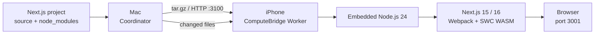

Macで書いているNext.jsプロジェクトをiPhoneへ送り、iPhoneのCPUとRAMを使って開発サーバーを起動する実験アプリ「ComputeBridge」を作りました。

最初はMacとiPhoneでRAMを共有できないかと考えていました。しかし、macOSのプロセスが使うメモリをiPhoneへ透過的に移すことはできません。そこで対象を明示的な処理に絞り、MacをCoordinator、iPhoneをWorkerとして動かす構成にしました。

最初にMonte Carlo法のπ計算を分散させ、その次に実用寄りの題材としてNext.jsの開発サーバーをiPhone上で動かしました。最終的にNext.js 15と16を実機iPhoneで起動し、Macからソース変更を同期できるところまで実装しています。

:::message
これはNext.js公式のiOS対応機能ではなく、Next.js内部の実装に依存する技術検証です。動作確認できたバージョンと制限を記事後半に記載します。
:::


*最初に実装したMonte Carlo πベンチマーク*

## 作ったもの

ComputeBridgeはSwiftUI製のmacOSアプリとiOSアプリで構成されています。

- MacでNext.jsプロジェクトのフォルダを選択
- iPhoneに表示したQRコードで接続先とペアリングトークンを入力
- プロジェクトと`node_modules`を圧縮してiPhoneへ転送
- iPhone内のNode.js 24からNext.js開発サーバーを起動
- Macで変更されたソースファイルをiPhoneへ同期
- iPhoneまたはMacから開発サーバーを停止
- Wi-FiとUSBインターネット共有の両方に対応

開発サーバーはiPhoneのポート`3001`で待ち受けます。同じLANにいるMacから、次のようなURLを開きます。

```text
http://192.168.x.x:3001
```

## 全体構成



iPhoneアプリにはNode.jsを実行できるXCFrameworkを組み込んでいます。今回使ったのは、iOS向けNode.js 24を提供する[`fogtape/nodejs-mobile`](https://github.com/fogtape/nodejs-mobile)です。

iPhoneアプリを開くと、埋め込まれたNode.jsが転送用HTTPサーバーをポート`3100`で起動します。Macアプリはそこへプロジェクトを送り、展開完了後にNext.jsを起動します。

## `npm run dev`をそのまま実行しているわけではない

iOSアプリでは、任意の実行ファイルや子プロセスを起動できません。通常の`npm run dev`はNode.jsのプロセスを追加で起動し、Next.js CLIも内部でサーバープロセスを作ります。この経路はiOSでは`EPERM`になります。

ComputeBridgeでは、すでに動いているNode.jsプロセスからNext.js内部の`startServer()`を直接呼び出しています。

```js:Runtime/next-dev-worker.cjs
const { startServer } = require(
  path.join(project, "node_modules/next/dist/server/lib/start-server")
)

await startServer({
  dir: project,
  isDev: true,
  hostname: "0.0.0.0",
  port: 3001,
  allowRetry: false,
})
```

Next.jsサーバー全体はWorker Thread内で動かします。これによりiPhoneアプリ側の転送サーバーを動かしたまま、Next.jsだけを開始・停止できます。

## 最大の壁は「iOS用のSWCがない」こと

Next.jsはJavaScriptやTypeScriptの変換にSWCを使います。通常配布されているSWCのネイティブバイナリには、macOS、Linux、Windows向けがあります。iOS arm64向けのバイナリは含まれていません。

そこで、SWCのWASM版である`@next/swc-wasm-nodejs`を使いました。

Next.js 16ではNext.js本体とWASMパッケージのバージョンを一致させる必要があります。Mac側に一致するパッケージがない場合、転送スクリプトがnpmレジストリから取得します。

```text
next: 16.3.5
@next/swc-wasm-nodejs: 16.3.5
```

ダウンロード時にはnpmメタデータのSHA-512 integrityを検証し、正しいバージョンのパッケージだけをiPhone向けアーカイブへ追加しています。Mac側のプロジェクトにはインストールしません。

Next.js 16はTurbopackを使わず、Webpackモードで起動します。TurbopackはネイティブSWCに依存するため、現在のiOS構成では利用できません。

## Next.js内部に残っていた子プロセス起動

SWCをWASMへ切り替えただけでは起動しませんでした。Next.jsの開発サーバー内部にも、子プロセスを前提とする処理が残っています。

ComputeBridgeでは、iPhoneへ転送したNext.jsのコピーに次の互換処理を適用しています。

| Next.jsの処理 | iPhone向けの処理 |
| --- | --- |
| CLIからサーバープロセスを起動 | `startServer()`を直接呼び出す |
| Jest WorkerのChild Process | Worker Threadを有効化 |
| `process.title`の変更 | iPhone内のコピーではスキップ |
| Unixシグナルによる終了 | ComputeBridgeの停止メッセージで終了 |
| 通常のファイル監視 | `WATCHPACK_POLLING=1000`を使用 |
| TypeScript CLI | TypeScript Compiler APIを使用 |

これらの変更はiPhoneへ転送されたコピーだけに適用します。Mac上の元プロジェクトと`node_modules`は変更しません。

## Next.js 16.3.5で遭遇した`spawn EPERM`

Next.js 16.3.5を実プロジェクトで起動したとき、サーバーが一度`Ready`を表示した直後に終了しました。

```text
ComputeBridge: Next.js exited with code 1
Transfer stopped with code 1.
```

実機ログでは次のエラーが出ていました。

```text
Error: spawn EPERM
```

最初はNext.jsのWorker PoolがChild Processを作っていると考えました。そこで一時的に`child_process.spawn`をラップし、呼び出し元のスタックを記録しました。

```js:一時的に追加した診断コード
const childProcess = require("node:child_process")
const originalSpawn = childProcess.spawn

childProcess.spawn = function (command, args, options) {
  console.error(command, args)
  console.error(new Error("spawn call site").stack)
  return originalSpawn.call(this, command, args, options)
}
```

実際に起動しようとしていたのは、TypeScriptの設定を取得する次のコマンドでした。

```text
typescript/bin/tsc --showConfig --project tsconfig.json --pretty false
```

Next.js 16.3.5では`experimental.useTypeScriptCli`が既定で有効です。この処理が`tsc`を子プロセスとして起動していました。

iPhone内のNext.js設定だけ`useTypeScriptCli: false`へ変更すると、Next.jsはインストール済みTypeScriptのCompiler APIで`tsconfig.json`を解析します。これで子プロセスが不要になり、実機で`ready`を維持できるようになりました。

## ファイル転送と差分同期

初回転送ではプロジェクトを`tar.gz`にまとめます。

```text
project/
├── app/
├── public/
├── package.json
├── tsconfig.json
└── node_modules/
```

次のファイルは除外しています。

- `.git`
- `.next`
- `.npmrc`
- `.env*`
- `node_modules/.cache`

転送後はMac側でファイルの更新時刻とサイズを1秒ごとに確認し、変更されたファイルだけをiPhoneへ送ります。iPhone上ではWebpackのポーリング監視が変更を検知し、対象ページを再コンパイルします。

依存関係を変更した場合は、現在の実装ではプロジェクト全体を送り直します。

## QRコードによる接続

手入力が必要だった接続先IPアドレスとペアリングトークンは、iPhone側にQRコードを表示してMacのカメラから読み取れるようにしました。


*開発途中のNext.js転送UI。IPアドレスとトークンを使って接続する*

QRコードには次の情報だけを含めています。

```json
{
  "host": "192.168.x.x",
  "token": "起動ごとに生成するトークン"
}
```

転送APIと操作APIはこのトークンを要求します。通信自体はローカルHTTPで、TLS暗号化はしていません。信頼できるLANまたはUSBインターネット共有で使う前提です。

## 実機で確認できた範囲

| 対象 | 結果 |
| --- | --- |
| 埋め込みNode.js | Node 24.21.0、`platform: ios`、`arm64` |
| Next.js 15.5.18 | 実プロジェクトを転送し、ページのHTTP 200を確認 |
| Next.js 16.3.8 | 最小App RouterプロジェクトでHTTP 200を確認 |
| Next.js 16.3.5 | 実プロジェクトで開発サーバーの`ready`維持を確認 |
| ソース同期 | 既存ページの変更と新規ルート追加を確認 |
| 停止操作 | iPhoneからNext.jsを停止できることを確認 |

Next.js 15の実プロジェクトでは、約130.4MBの圧縮アーカイブを実機へ転送しました。ページのHTTP 200と、未認証APIの想定どおりのHTTP 401を確認しています。

Next.js 16.3.5の実プロジェクトではサーバー起動まで成功しましたが、最初のページはClerkの環境変数不足でHTTP 500になりました。`.env*`を意図的に転送対象から外しているためです。Next.js自体は終了せず、ポート`3001`で`ready`を維持しました。

:::message alert
現在のComputeBridgeは`.env*`を転送しません。認証やデータベースの環境変数を必要とするページは、Next.js起動後もエラーになる場合があります。
:::

## 起動手順

必要な環境はXcode 16以降、macOS 14以降、iOS 17以降、XcodeGenです。

```bash
xcodegen generate
open ComputeBridge.xcodeproj
```

Xcodeから次の2つを実行します。

1. `ComputeBridgeMac`をMacで起動
2. `ComputeBridgeiOS`を実機iPhoneで起動

iPhone側で`Start runtime`を押し、Mac側でQRコードを読み取ります。その後、Next.jsプロジェクトのフォルダを選んで`Send and run`を押します。

CLIから同じ転送を行う場合は次のコマンドです。

```bash
python3 scripts/send-next-project.py \
  '/path/to/next-project' \
  --host IPHONE_IP \
  --token PAIRING_TOKEN
```

## 現在の制限

### iPhoneアプリを前面で開く必要がある

iOSは一般的な開発サーバーの常駐環境ではありません。画面ロックや他アプリへの切り替えで通信や処理が止まる場合があります。実験中はアイドルタイマーを無効化し、Workerアプリを前面に置いています。

### 任意の`npm run dev`には対応していない

ComputeBridgeが起動できるのは、現在対応しているNext.js 15と16の開発サーバーです。Vite、Astro、各種CLI、postinstall、ネイティブアドオンなどは個別対応が必要です。

### macOS用ネイティブアドオンは動かない

転送した`node_modules`にmacOS用の`.node`バイナリが含まれていても、iOSでは読み込めません。純粋なJavaScript、WASM、iOS対応ライブラリで構成された経路だけが動きます。

### `.env`を転送していない

認証、データベース、決済などの秘密情報は現在iPhoneへ送りません。そのため、環境変数を必須とするページは起動後にエラーになります。将来的には、転送するキーを利用者が明示的に選ぶ方式を検討しています。

### ディスク使用量が大きい

`node_modules`を含めるため、プロジェクトによっては数百MBになります。初回転送のキャッシュと依存関係の差分同期が今後必要です。

## RAM共有から「処理を移す」設計へ

この実験で扱えるのは、ComputeBridge用に入力と出力を定義した処理です。Mac上で動く任意のアプリのメモリやCPU処理を、そのままiPhoneへ移動する仕組みではありません。

一方で、Node.jsをiOSアプリへ埋め込み、iOSの制約に合わせて実行経路を作れば、Web開発の一部をiPhone側へ持っていけることは確認できました。

特に効いたのは次の3点です。

1. CLIを起動せず、ライブラリ内部のサーバーAPIを直接呼ぶ
2. ネイティブ依存をWASMへ置き換える
3. Child ProcessをWorker ThreadまたはインプロセスAPIへ置き換える

これはNext.js公式の対応環境ではなく、内部実装に依存する実験です。Next.jsの更新によってパッチ対象が変わる可能性があります。それでも、実機iPhoneでNext.js 16のWebpack開発サーバーが起動し、Macからアクセスできるところまでは到達しました。

## 次にやりたいこと

- 転送する環境変数を選択できるUI
- `node_modules`とWASMパッケージの端末側キャッシュ
- USB接続の自動検出
- Next.jsのログをMacアプリへ表示
- プロジェクトごとの互換性チェック
- 初回転送後の依存関係差分同期

今後は、iPhoneを小さな開発用Workerとしてどこまで実用化できるかを試していきます。

## 参考

@[card](https://github.com/fogtape/nodejs-mobile)

@[card](https://nextjs.org/docs/pages/getting-started/installation)

@[card](https://github.com/vercel/next.js/tree/canary/packages/next-swc)
